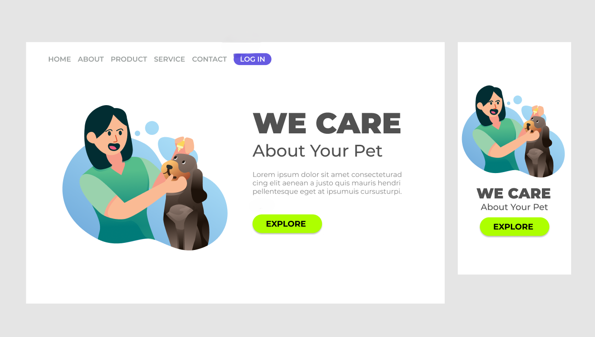

# We Care - Pet Care Landing Page

Este é um projeto de estudo para praticar HTML e CSS, focando em design responsivo para uma landing page de cuidados com animais de estimação.

## Visão Geral do Projeto

## Descrição do Projeto

Esta landing page simula um serviço de cuidados com animais de estimação. O projeto foi desenvolvido como parte de um exercício para aprimorar habilidades em desenvolvimento web front-end, com ênfase em design responsivo.

## Características

- Design moderno e amigável
- Layout responsivo para desktop e mobile
- Menu de navegação claro
- Botão de login
- Ilustração atraente de pessoa com animal de estimação
- Chamada para ação com botão "EXPLORE"

## Tecnologias Utilizadas

- HTML5
- CSS3

## Aprendizados

Este projeto permitiu praticar:
- Estruturação semântica de uma página web com HTML5
- Estilização avançada usando CSS3
- Técnicas de design responsivo para adaptação a diferentes dispositivos
- Criação de layouts flexíveis e alinhamento de elementos
- Implementação de elementos de UI como botões e menus de navegação

## Como Visualizar

1. Clone este repositório:
